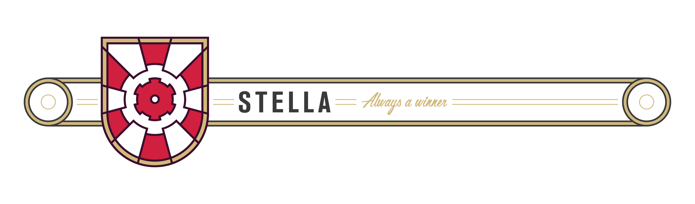

[](https://travis-ci.org/icapps/ios-stella)
[](http://cocoapods.org/pods/Stella)
[](http://cocoapods.org/pods/Stella)
[](https://swift.org)

> Stella contains a set of utilities that can be used during iOS development in Swift.

## TOC

- [Installation](#installation)
  - [Swift Package Manager](#swift-package-manager)
  - [Cocoapods](#cocoapods)
  - [Carthage](#carthage)
- [Features](#features)
  - [Defaults](#defaults)
  - [Keychain](#keychain)
  - [Localization](#localization)
  - [Extensions](#extensions)
    - [Array](#array)
    - [Bundle+Versions](#bundleversions)
    - [CALayer+Shadow](#calayershadow)
    - [CGFloat+Radians](#cgfloatradians)
    - [UIView+Responder](#uiviewresponder)
    - [UICollectionView+Reuse](#uicollectionviewreuse)
    - [UITableView+Reuse](#uitableviewreuse)
    - [UIView+Constraints](#uiviewconstraints)
    - [UIView+Nib](#uiviewnib)
    - [UIViewController+Child](#uiviewcontrollerchild)
    - [UIViewController+Storyboard](#uiviewcontrollerstoryboard)
    - [UIViewController+TopMost](#uiviewcontrollertopmost)
    - [Optionals](#optionals)
- [Contribute](#contribute)
  - [How to contribute?](#howtocontribute)
  - [Contributors](#contributors)
- [License](#license)

## Installation 💾

## Swift Package Manager

You can install `Stella` using the Swift Package Manager. This is available starting from Xcode 11. Just search for `icapps/ios-stella` and install it.

### Cocoapods

Stella is available through [CocoaPods](http://cocoapods.org). To install it, simply add the following line to your `Podfile`:

```ruby
pod 'Stella', git: 'https://github.com/icapps/ios-stella.git', commit: '...'
```

_Pass the correct commit reference to make sure your code doesn't break in future updates._

### Carthage

To integrate Stella into your Xcode project using Carthage, specify it in your `Cartfile`"

```ruby
github "icapps/ios-stella" ~> 1.5.1
```

Then, run the following command to build the Stella framework:

```sh
carthage update
```

Perform the additional steps in orde the get Carthage setup with this framework: [Carthage's README](https://github.com/Carthage/Carthage#getting-started)

## Features

### Defaults

We have a cleaner way to use `NSUserDefaults`. Define the user defaults by extending the `DefaultsKeys` class.

```swift
extension DefaultsKeys {
  // Writes a string object to the defaults with the 'stringValue' key.
  static let stringValue = DefaultsKey<String?>("stringValue")
  // Writes an integer to the defaults with the 'integerValue' key.
  static let integerValue = DefaultsKey<Int?>("integerValue")
  // Writes a double to the defaults with the 'doubleValue' key.
  static let doubleValue = DefaultsKey<Double?>("doubleValue")
  // Writes a float to the defaults with the 'floatValue' key.
  static let floatValue = DefaultsKey<Float?>("floatValue")
  // Writes a bool to the defaults with the 'booleanValue' key.
  static let booleanValue = DefaultsKey<Bool?>("booleanValue")
  // Writes a date object to the defaults with the 'dateValue' key.
  static let dateValue = DefaultsKey<NSDate?>("dateValue")
  // Writes a dictionary object to the defaults with the 'dictValue' key.
  static let dictValue = DefaultsKey<[String: Any]?>("dictValue")
}
```

You can read/write the from/to the `NSUserDefaults` by using the `subscript` on the `Defaults` class.

```swift
Defaults[.stringValue] = "A string value"
print(Defaults[.stringValue]) // Prints 'A string value'

Defaults[.integerValue] = 123
print(Defaults[.integerValue]) // Prints '123'

Defaults[.doubleValue] = 123.123
print(Defaults[.doubleValue]) // Prints '123.123'

Defaults[.floatValue] = 123.321
print(Defaults[.floatValue]) // Prints '123.312'

Defaults[.booleanValue] = true
print(Defaults[.booleanValue]) // Prints 'true'

Defaults[.dateValue] = NSDate()
print(Defaults[.dateValue]) // Prints '1996-12-19T16:39:57-08:00'

Defaults[.dictValue] = ["SomeKey" : "SomeValue"]
let value = Defaults[.dictValue]
print(value["SomeKey"]) // Prints 'SomeValue'
```

### Keychain

We have a cleaner way to use the `Keychain`. Define the user defaults by extending the `Keys` class.

```swift
extension Keys {
  // Writes a string object to the keychain with the 'stringValue' key.
  static let stringValue = Key<String?>("stringValue")
}
```

You can read/write the from/to the `Keychain` by using the `subscript` on the `Keychain` class.

```swift
Keychain[.stringValue] = "A string value"
print(Keychain[.stringValue]) // Prints 'A string value'
```

In some cases you want to be able to set additional keychain query paramaters on an item.

```swift
static let noBackupValue = Key<String?>("noBackup", {
  return [kSecAttrAccessible as String: kSecAttrAccessibleAlwaysThisDeviceOnly]
}())
```

### Localization

Localize a key in no time with this handy localization function.

```swift
let key = "this_is_your_localization_key"
print(key.localizedString)
// The debug console will print the localized
// string found in your .strings file.
```

### Extensions

#### Array

Fetch an element from an array that could possible be out of bounds.

```swift
let array = [1, 2, 3, 4]
array[safe: 2] // Returns 3
arra[safe: 10] // Returns nil
```

Returns the array with a limited subset starting from the front/rear.

```swift
let array = [1, 2, 3, 4]
array.truncate(by: 2) // Returns [1, 2]
array.reverseTruncate(by: 2) // Returns [3, 4]
```

Returns if an element is found in an array.

```swift
let array = [1, 2, 3, 4]
array.contains(2) // Returns true
array.contains(10) // Returns false
```

Returns an array with unique values depending on the `Hashable` value.

```swift
let array = [1, 2, 3, 2, 4, 1]
array.unique // Returns [1, 2, 3, 4]
```

Remove an element from an array and returns the removed index.

```swift
var array = [1, 2, 3, 4]
array.remove(3) // Returns 2
array // Mutated to [1, 2, 4]
```

#### Bundle+Versions

Get the marketing and build version quickly from the bundle.

```swift
let bundle = Bundle.main
bundle.shortVersionString // Returns 1.2.3
bundle.bundleVersion // Returns 1 (the build version)
```

#### CALayer+Shadow

Quickly add a shadow around a certain view

```swift
let view = UIView()
view.layer.applyShadow()

let customShadowView = UIView()
customShadowView.layer.applyShadow(color: .red, opacity: 0.2, x: 0, y: 4, blur: 10, spread: 0)
```

Quickly remove a shadow from a certain view

```swift
let view = UIView()
view.layer.removeShadow()
```

#### CGFloat+Radians

Convert from degrees to radians and vice versa.

```swift
CGFloat(180).degreesToRadians // Returns .pi
CGFloat.pi.radiansToDegrees // Returns 180.0
```

#### UIView+Responder

Get the `UIViewController` that manages your view.

```swift
let controller = UIViewController()
controller.view.respondingController // Returns the controller instance.
```

#### UICollectionView+Reuse

Register and reuse cells in a type safe way.

```swift
// Register a cell from a nib with the same name.
collectionView.register(CustomCollectionViewCell.self)

// Register a reusable view from a nib with the same name.
collectionView.register(CustomReusableView.self, forSupplementaryViewOfKind: "Some")

// Dequeue a cell of type CustomCollectionViewCell
collectionView.dequeueReusableCell(for: indexPath) as CustomCollectionViewCell

// Dequeue a reusable view of type CustomReusableView
collectionView.dequeueReusableSupplementaryView(ofKind: "Some", for: indexPath) as CustomReusableView
```

#### UITableView+Reuse

Register and reuse cells in a type safe way.

```swift
// Register a cell from a nib with the same name.
tableView.register(CustomTableViewCell.self)

// Register a footer view from a nib with the same name.
tableView.registerHeaderFooter(CustomFooterView.self)

// Dequeue a cell of type CustomTableViewCell
tableView.dequeueReusableCell(forIndexPath: indexPath) as CustomTableViewCell

// Dequeue a cell of type CustomTableViewCell with a custom identifier.
tableView.dequeueReusableCell(forIdentifier: "identifier") as CustomTableViewCell

// Dequeue a header view of type CustomReusableView with a custom identifier.
tableView.dequeueReusableHeaderFooter(forIdentifier: "identifier") as CustomReusableView

// Dequeue a header view of type CustomReusableView.
tableView.dequeueReusableHeaderFooter(forIdentifier: "identifier") as CustomReusableView

// Get the types cell for row.
tableView.cellForRow(at: indexPath) as CustomTableViewCell
```

#### UIView+Constraints

Constraint a subview quickly to the bounds of the superview.

_Optionally you can add insets that set some spacing inside the view._

```swift
view.constraint(to: superview)
view.constraint(to: superview, insets: .zero)

// Same as above but take safe area's into account.
view.constraint(to: superview, safeAreaInsets: .zero)
```

#### UIView+Nib

Get access to reuse identifiers.

```swift
// Return the name of the view's class as it's reuse identifier.
UIView.reuseIdenfier

// Return the name of the view's class as it's nib name.
UIView.nibName

// Return the nib matching the class name of the view.
UIView.nib
```

Load the `UIView` from a nib with the same name.

_It is important to type the destination property in orde to load the correct nib._

```swift
let view: SomeView = UIView.loadFromNib()
```

#### UIViewController+Child

Easily add and remove a controller as a childViewController.

_Optionally you can add insets that set some spacing inside the container view._

```swift
// Add the controller to the container view, pin it and handle the containment correctly.
rootController.add(childController: controller, to: containerView)
rootController.add(childController: controller, to: containerView, insets: .zero)

// Add the same child controller as above, but take the safe area's into account.
rootController.add(childController: controller, to: containerView, safeAreaInsets: .zero)

// Remove the controller and handle the containtment correctly.
rootController.remove(childController: controller)
```

#### UIViewController+Storyboard

Load the view controller directly from a storyboard.

```swift
// Load the initial controller from the storyboard.
let controller = SomeController.from(storyboard: "StoryboardName")

// Pass a custom bundle to load from.
let controller = SomeController.from(storyboard: "StoryboardName", bundle: CustomBundle())

// Load a controller with the given storyboard identifier.
let controller = SomeController.from(storyboard: "StoryboardName", identifier: "SomeControllerIdentifier")
```

#### UIViewController+TopMost

Get the `UIViewController` that is currently presented on top of the application. It doesn't matter if a `UINavigationController` or a `UITabBarController` is in play or not.

```swift
let controller = UIAlertController(...)

// Present an alert an top of all the controllers.
otherController.topMostViewController.present(controller, animated: false, completion: nil)
```

#### Optionals

Added soms easy to used optional intializers.

```swift
URL(string: nil)
UIImage(data: nil)
```

## Contribute

### How to contribute ❓

1. Add a Github issue describing the missing functionality or bug.
2. Implement the changes according to the `Swiftlint` coding guidelines.
3. Make sure your changes don't break the current version. (`deprecate` is needed)
4. Fully test the added changes.
5. Send a pull-request.

### Contributors 🤙

- Jelle Vandebeeck, [@fousa](https://github.com/fousa)
- Dylan Gyesbreghs, [@dgyesbreghs](https://github.com/dgyesbreghs)
- Hans Van Herreweghe, [@herre](https://github.com/herre)
- Hannes Van den Berghe, [@HannesVDB](https://github.com/HannesVDB)
- Alain Hufkens, [@hufkens](https://github.com/HannesVDB)
- Stijn Willems, [@doozMen](https://github.com/doozMen)

## License

Stella is available under the MIT license. See the LICENSE file for more info.
